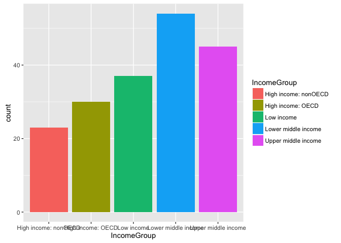

# CaseStudyUnit6_GDP
Jean Jecha  
June 20, 2016  
### GDP Data Analysis

This report is an analysis of the gross domestic product (GDP) ranking data with education statistics for countries. Some of the analysis includes GDP summaries by the two high income groups. Graph showing totals by income groups. Breaking up the GDP rankings into separate quantiles and analyzing that with the education income groups. Finally viewing the top 38 ranking nations that are lower middle income. 


```r
###############################
#  Load packages needed for analysis
#  download and clean data files
#
################################
# Load packages
library(repmis)
library(countrycode)
library(plyr)
library(dplyr)
```

```
## 
## Attaching package: 'dplyr'
```

```
## The following objects are masked from 'package:plyr':
## 
##     arrange, count, desc, failwith, id, mutate, rename, summarise,
##     summarize
```

```
## The following objects are masked from 'package:stats':
## 
##     filter, lag
```

```
## The following objects are masked from 'package:base':
## 
##     intersect, setdiff, setequal, union
```

```r
library(ggplot2)

#  Place the GDP data URL into the object FinURL
FinURL <- "https://d396qusza40orc.cloudfront.net/getdata%2Fdata%2FGDP.csv"

#  Download data and read into data frame
FGDPData <- read.csv(FinURL,skip = 5, header=FALSE,sep = ',' )
# str(FGDPData)
# head(FGDPData)

#  Get Usable columns and remove rows with no country code or rank
#    get columns 1 - 6 and remove rows with no ranking data
FGDPData.2 <- FGDPData[!FGDPData$V2 == "",c(1:6)]

#  Final columns of country code, ranking, country and GDP amount
#      Eliminate any rows with no country code
FGDPData.3 <- FGDPData.2[!FGDPData.2$V1 == "",c(1:2,4:5)]
# head(FGDPData.3)
# tail(FGDPData.3)

#  adding column headers
col_headings <- c("CountryCode", "Ranking", "country", "GDP")
names(FGDPData.3) <- col_headings

#  change rankink column to integer for sorting
FGDPData.3$Ranking <- as.integer(as.character(FGDPData.3$Ranking))

#  remove commas and convert to numeric, 
#    needed to remvove commas for conversion to numeric
FGDPData.3$GDPAmount <- gsub(",","",FGDPData.3$GDP)
FGDPData.3$GDPAmount <- as.numeric(as.character(FGDPData.3$GDPAmount))

#  convert country code to character
FGDPData.3$CountryCode <- as.character(FGDPData.3$CountryCode)


#  Place the education URL into the object FedStatsURL
FedStatsURL <- "https://d396qusza40orc.cloudfront.net/getdata%2Fdata%2FEDSTATS_Country.csv"

#  Download data and read into data frame
FedStatsData <- read.csv(FedStatsURL, header=TRUE,sep = ',' )

#  converting income group and country code to character
FedStatsData$IncomeGroup <- as.character(FedStatsData$Income.Group)
FedStatsData$CountryCode <- as.character(FedStatsData$CountryCode)
#  str(FedStatsData)

#  removing country codes with no income groups
FedStatsData.2 <- FedStatsData[!FedStatsData$Income.Group == "",c(1,32)]
```


#### Countries in GDP matching countries in educatianal data
The following shows the number of rows that match in both the GDP and educational data for both files. This is after the data is cleaned and matched.

```r
# Question 1 row count of matching rows
length(match(FGDPData.3$CountryCode, FedStatsData.2$CountryCode, nomatch = 0))
```

```
## [1] 190
```

```r
# merge GDP with educational data
MergeGDPData <- merge(
  FGDPData.3, FedStatsData.2,
  by="CountryCode",
  all = TRUE
)

#  Remove NA rows due to merging files
GDPDataTidy <- MergeGDPData[is.na(MergeGDPData$GDPAmount)==0,]
GDPDataTidy <- na.omit(MergeGDPData)
```


##### Reporting the 13th country from the lower ranked 
Showing what country is ranked 13th from bottom ranking 

```r
# Question 2, sort GDP rank listing the 13th country 
Row13 <- GDPDataTidy[order(GDPDataTidy$Ranking,decreasing = TRUE),]
Row13[13,]
```

```
##     CountryCode Ranking             country   GDP GDPAmount
## 102         KNA     178 St. Kitts and Nevis  767        767
##             IncomeGroup
## 102 Upper middle income
```

```r
# head(Row13,13)
```


##### Average GDP Amount
Analysis of the average GDP Amount in the income groups of high income: OECD and high income: nonOECD

```r
# Question 3 Average GDP rankings for High income OECD and High Income nonOECD
GDPHighIncome <- GDPDataTidy[
      GDPDataTidy$IncomeGroup == "High income: nonOECD" | 
      GDPDataTidy$IncomeGroup == "High income: OECD", ]

GDPHighIncome.2 <- GDPHighIncome[,5:6]
#  head(GDPHighIncome.2,200)
aggregate(GDPHighIncome.2[, 1], list(GDPHighIncome.2$IncomeGroup), mean)
```

```
##                Group.1         x
## 1 High income: nonOECD  104349.8
## 2    High income: OECD 1483917.1
```


##### GDP graph by Income Group
Graph indicating the GDP income broken out by the country income group.

```r
#  Question 4
ggplot(data=GDPDataTidy, aes(x=IncomeGroup, fill = IncomeGroup)) + 
    geom_bar()
```

<!-- -->


##### GDP ranking quantile compared to Income Group


```r
#  Question 5
#   Breaking into quantiles showing results vs. Income Group
GDPDataTidyQuantile <- GDPDataTidy %>% mutate(quantile = ntile(Ranking, 5))
ddply(GDPDataTidyQuantile, c("quantile", "IncomeGroup"),
      summarise,NbrOccur=length(GDPAmount))
```

```
##    quantile          IncomeGroup NbrOccur
## 1         1 High income: nonOECD        4
## 2         1    High income: OECD       18
## 3         1  Lower middle income        5
## 4         1  Upper middle income       11
## 5         2 High income: nonOECD        5
## 6         2    High income: OECD       10
## 7         2           Low income        1
## 8         2  Lower middle income       13
## 9         2  Upper middle income        9
## 10        3 High income: nonOECD        8
## 11        3    High income: OECD        1
## 12        3           Low income        9
## 13        3  Lower middle income       12
## 14        3  Upper middle income        8
## 15        4 High income: nonOECD        5
## 16        4    High income: OECD        1
## 17        4           Low income       16
## 18        4  Lower middle income        8
## 19        4  Upper middle income        8
## 20        5 High income: nonOECD        1
## 21        5           Low income       11
## 22        5  Lower middle income       16
## 23        5  Upper middle income        9
```


##### Top 38 ranked countries with lower middle income
Results of the top 38 ranked countries that fall into the lower middle income range of education.

```r
#  Showing top 38 GDP ranked countries with "Lower Middle Income"
GDP38 <- GDPDataTidy[order(GDPDataTidy$Ranking,decreasing = FALSE),]
GDP38 <- GDP38[1:38,]
GDP38[GDP38$IncomeGroup == "Lower middle income",c(1:3,5:6)]
```

```
##     CountryCode Ranking          country GDPAmount         IncomeGroup
## 37          CHN       2            China   8227103 Lower middle income
## 87          IND      10            India   1841710 Lower middle income
## 85          IDN      16        Indonesia    878043 Lower middle income
## 185         THA      31         Thailand    365966 Lower middle income
## 56          EGY      38 Egypt, Arab Rep.    262832 Lower middle income
```
